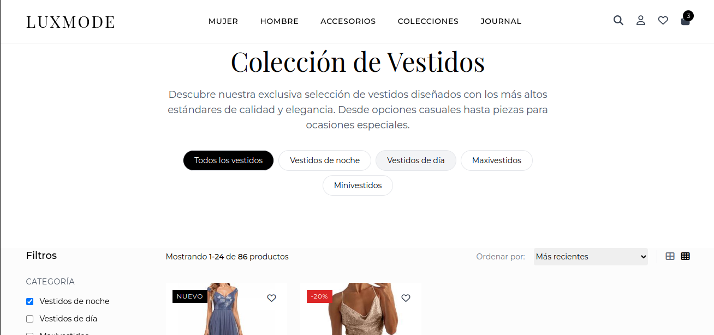

# LUXMODE UX/UI Design Documentation

## 1. Overview
- **Project Name**: LUXMODE
- **Purpose**: A clothing store website showcasing premium collections.

## 2. Design Elements
- **Typography**: 
  - Primary Font: Montserrat (sans-serif)
  - Secondary Font: Playfair Display (serif)

- **Color Palette**: 
  - Background: #fcfcfc (light gray)
  - Text: #000000 (black) and #f87171 (red for accents)
  - Button Backgrounds: Varies (white with hover effects)

## 3. Structure
- **Header**: 
  - Contains the logo, navigation links (Mujer, Hombre, Accesorios, Colecciones, Journal), and icons for user account, wishlist, and shopping bag.
  - Responsive design with a mobile menu toggle.

- **Breadcrumb Navigation**: 
  - Displays the current path within the site, enhancing user navigation.

- **Collection Header**: 
  - Introduces the collection with a title and description.

- **Filters Section**: 
  - Allows users to filter products by category, color, size, and price.
  - Includes checkboxes for categories and color options, as well as a price range slider.

- **Product Grid**: 
  - Displays products in a grid format with hover effects for quick view and wishlist options.
  - Each product card includes an image, title, price, and rating.

## 4. Animations
- **Loading Screen**: 
  - Features a rotating circle and pulsing elements to indicate loading.
  - Uses GSAP for smooth animations and transitions.

- **Hover Effects**: 
  - Product cards and buttons have hover effects that enhance interactivity.

## 5. User Experience Considerations
- **Responsive Design**: 
  - The layout adapts to different screen sizes, ensuring usability on mobile devices.
  
- **Accessibility**: 
  - Considerations for color contrast and text readability.

## 6. Conclusion
- The design of the LUXMODE website focuses on elegance and user-friendliness, providing a seamless shopping experience.
